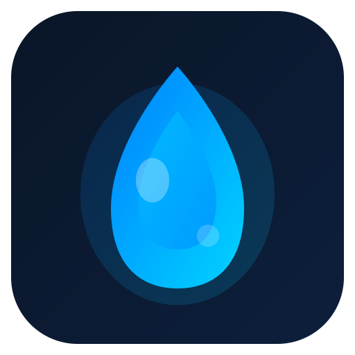
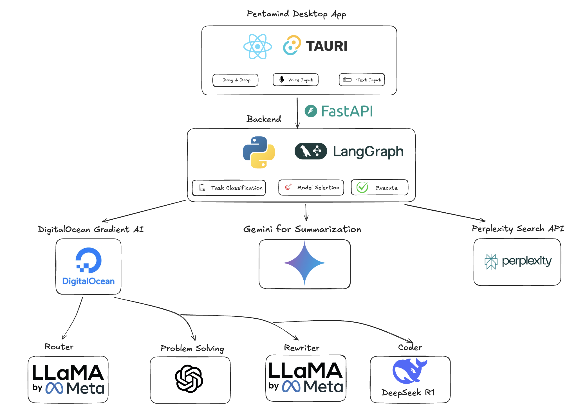

<p align="center">
  
</p>

<h1 align="center">Pentamind</h1>

<p align="center">
  <strong>🌊 Five Minds, One Answer — Intelligent Multi-Model AI Orchestration</strong>
</p>

<p align="center">
  <a href="#inspiration">Inspiration</a> •
  <a href="#what-it-does">What It Does</a> •
  <a href="#how-we-built-it">How We Built It</a> •
  <a href="#challenges">Challenges</a> •
  <a href="#accomplishments">Accomplishments</a> •
  <a href="#what-we-learned">What We Learned</a> •
  <a href="#whats-next">What's Next</a>
</p>

<p align="center">
  
  
  
  
</p>

---

## The Problem

**AI models are not created equal.** Each excels at different tasks:

- Claude is exceptional at coding
- DeepSeek R1 dominates mathematical reasoning
- Gemini handles massive documents with ease
- Perplexity provides real-time web research
- Mistral excels at text refinement

**But users shouldn't need to know this.** They shouldn't have to:

- Switch between 5 different AI apps
- Guess which model is best for their task
- Pay for multiple subscriptions
- Copy-paste between tools

**The result?** Suboptimal AI responses, wasted time, and frustrated users.

---

## Inspiration

We were frustrated by the fragmented AI landscape. Every day, we found ourselves:

- Opening ChatGPT for general questions
- Switching to Claude for coding help
- Using Perplexity for research with citations
- Going to Wolfram Alpha for math problems
- Using different tools for summarization

**Why can't one intelligent system route our requests to the best model automatically?**

That's when Pentamind was born — a unified AI assistant that thinks with **five specialized minds** but speaks with **one voice**.

The name "Pentamind" comes from "Penta" (five) + "Mind" — representing the five specialized AI models working together as one cohesive intelligence.

---

## What It Does

Pentamind is a **desktop overlay application** that intelligently routes your requests to the optimal AI model based on your task:

### 🎯 Five Specialized Models for Five Task Types

| Task             | Model           | Why This Model                                |
| ---------------- | --------------- | --------------------------------------------- |
| **📝 Summarize** | Gemini 2.5 Pro  | 2M token context window for massive documents |
| **🔍 Research**  | Perplexity AI   | Real-time web search with citations           |
| **🧮 Solve**     | DeepSeek R1     | State-of-the-art mathematical reasoning       |
| **💻 Code**      | Claude Sonnet 4 | Best-in-class code generation                 |
| **✍️ Rewrite**   | Mistral Small   | Excellent text refinement and editing         |

### ✨ Key Features

- **🖥️ Always-On Overlay** — Floating window stays on top, ready when you need it
- **📄 Document Upload** — Drag & drop PDFs, DOCX, TXT files
- **🎤 Voice Input** — Speak your requests naturally
- **🔄 Smart Routing** — Automatic model selection based on task type
- **📊 LaTeX Rendering** — Beautiful math equations with KaTeX
- **⚡ Fast & Local** — Native Tauri app, no browser needed
- **🌊 Gradient AI Powered** — Enterprise-grade AI infrastructure via DigitalOcean

### 💡 Example Use Cases

```
"Summarize this 50-page research paper" → Gemini 2.5 Pro
"Find the latest news about AI regulations" → Perplexity
"Solve this differential equation step by step" → DeepSeek R1
"Write a Python function for binary search" → Claude Sonnet 4
"Make this email more professional" → Mistral Small
```

---

## How We Built It

### Architecture Overview

<p align="center">
  
</p>

### Tech Stack

**Frontend (Desktop App)**

- **Tauri v2** — Lightweight, secure native app framework
- **React 19** — Modern UI with hooks
- **TypeScript** — Type-safe development
- **Tailwind CSS v4** — Utility-first styling
- **KaTeX** — LaTeX math rendering

**Backend (AI Orchestration)**

- **FastAPI** — High-performance Python API
- **LangGraph** — Workflow orchestration for AI agents
- **pypdf + python-docx** — Document parsing
- **OpenAI Whisper** — Speech-to-text transcription

**AI Models via Gradient AI Agentic Cloud**

- `anthropic-claude-sonnet-4` — Code generation
- `deepseek-r1-distill-llama-70b` — Reasoning & math
- `mistral-small-3.1-24b-instruct` — Text editing
- `llama3.3-70b-instruct` — Fallback & routing
- `llama3-8b-instruct` — Fast task classification

**External APIs**

- **Gemini 2.5 Pro/Flash** — Long-context summarization
- **Perplexity AI** — Real-time web research

---

## Challenges We Ran Into

### 1. **Tauri Window Dragging Issues**

The transparent overlay window wouldn't drag properly after interacting with other apps. We solved this by implementing direct `startDragging()` API calls instead of relying on `data-tauri-drag-region`.

### 2. **File Drag & Drop in WebView**

Tauri's `dragDropEnabled` setting was intercepting browser drag events. Setting it to `false` allowed native HTML5 drag-and-drop to work correctly.

### 3. **Model API Rate Limits**

Different models have different rate limits and response times. We implemented intelligent fallback logic — if one model fails, the system automatically retries with an alternative.

### 4. **LaTeX Rendering**

AI models often return raw LaTeX (e.g., `\frac{a}{b}`). We integrated KaTeX to render beautiful math equations in the response view.

### 5. **macOS Window Hiding**

When hiding the overlay, clicking the dock icon wouldn't show it again. We had to handle the `Reopen` event in Rust to properly restore the window.

---

## Accomplishments That We're Proud Of

### 🏆 Technical Achievements

- **5 AI models orchestrated seamlessly** — Users never need to think about which model to use
- **Sub-second task classification** — Llama 3 8B classifies tasks in <500ms
- **2M token context support** — Gemini 2.5 Pro handles massive documents
- **Native desktop performance** — 10MB app size, instant startup

### 🎨 User Experience

- **One-click access** — Always-on overlay, always ready
- **Zero learning curve** — Just type, speak, or drop a file
- **Beautiful math rendering** — LaTeX equations look professional
- **Modern design** — Clean, elegant, gradient-inspired theme

### 📊 By The Numbers

| Metric               | Value                             |
| -------------------- | --------------------------------- |
| AI Models Integrated | 5+                                |
| Supported File Types | 6 (PDF, DOCX, TXT, MD, JSON, CSV) |
| Max Context Length   | 2,000,000 tokens                  |
| App Bundle Size      | ~10 MB                            |
| API Response Time    | <3 seconds average                |

---

## What We Learned

### Technical Insights

1. **LangGraph is powerful** — Orchestrating multi-model workflows becomes manageable with proper state machines
2. **Tauri v2 is production-ready** — Native performance with web technologies, but requires understanding platform quirks
3. **Model specialization matters** — Using the right model for the right task dramatically improves output quality

### Product Insights

1. **Simplicity wins** — Users don't want to think about which AI to use
2. **Context is king** — Seamless document upload changes how people interact with AI
3. **Desktop > Web for assistants** — Always-on overlays feel more integrated than browser tabs

### Team Insights

1. **AI-assisted development is a multiplier** — We built this entire project with AI pair programming
2. **Start with the UX** — We designed the user flow before writing code
3. **Ship fast, iterate faster** — The hackathon deadline forced focus on what matters

---

## What's Next for Pentamind

### 🚀 Short-Term Roadmap

- [ ] **Global keyboard shortcut** — Summon Pentamind with `Cmd+Shift+P`
- [ ] **Conversation history** — Save and search past interactions
- [ ] **Custom model preferences** — Let users override default routing
- [ ] **Clipboard integration** — Automatically process copied text

### 🌟 Long-Term Vision

- [ ] **Plugin system** — Extend Pentamind with custom tools
- [ ] **Team collaboration** — Share prompts and responses
- [ ] **Fine-tuned routing** — Learn user preferences over time
- [ ] **Mobile companion app** — Sync across devices
- [ ] **Enterprise deployment** — Self-hosted option for organizations

### 💭 The Dream

We envision Pentamind as the **universal AI interface** — a single, intelligent assistant that:

- Knows when to search the web
- Knows when to analyze documents
- Knows when to write code
- Knows when to solve equations
- Knows when to refine text

**One interface. Five minds. Infinite possibilities.**

---

## Quick Start

### Prerequisites

- Node.js 18+
- Python 3.11+
- Rust (for Tauri)
- API Keys: DigitalOcean, Gemini, Perplexity

### Installation

```bash
# Clone the repository
git clone https://github.com/bshiribaiev/pentamind.git
cd pentamind

# Backend setup
cd backend
python -m venv venv
source venv/bin/activate
pip install -r requirements.txt

# Set environment variables
export MODEL_ACCESS_KEY="your-digitalocean-key"
export GEMINI_API_KEY="your-gemini-key"
export PERPLEXITY_API_KEY="your-perplexity-key"

# Start backend
./start.sh

# Frontend setup (new terminal)
cd frontend
npm install
npm run tauri dev
```

---

## Team

Built with 💙 for the **MLH x DigitalOcean Hackathon**

---

<p align="center">
  <strong>Pentamind — Five Minds, One Answer</strong>
</p>

<p align="center">
  
</p>
